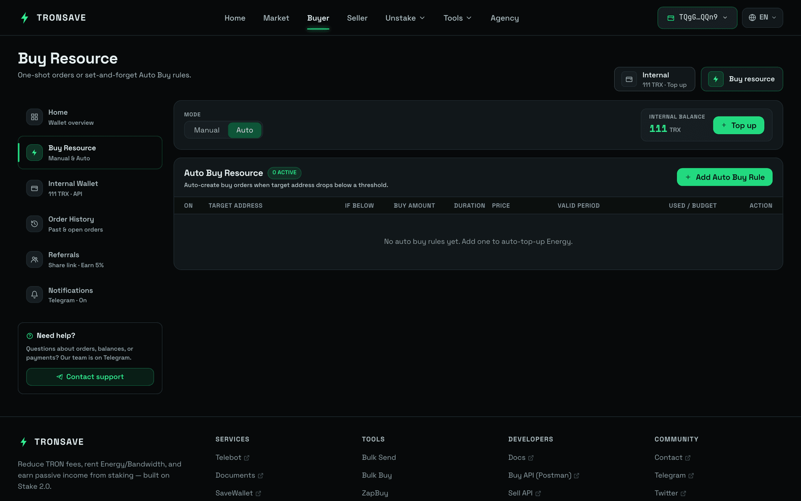
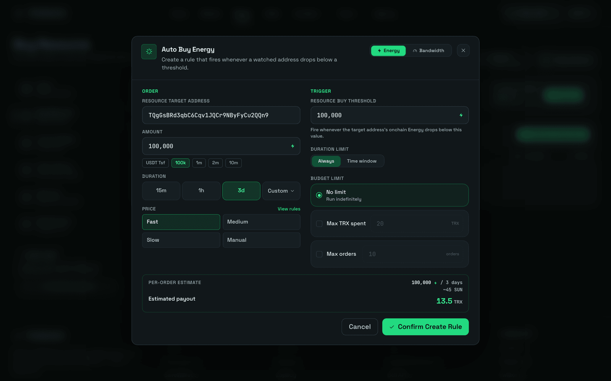

# Auto Buy

**Auto Buy** purchases Energy or Bandwidth for a target address automatically. Instead of creating buy orders by hand, TronSave places orders for you based on a rule you configure once, so the address never runs out of resources.


Auto Buy is paid from your **internal account** balance, not directly from your connected wallet. Fund the internal account before you start. For how internal accounts work, see [Pricing & APY](../../concepts/pricing-and-apy.md) and the broader [Order Types](../../concepts/order-types.md) overview.


## Set up an Auto Buy rule

### Step 1 — Connect your wallet

Connect your wallet at [tronsave.io](https://tronsave.io/dashboard/buyer/buy-resource).

### Step 2 — Open Buyer → Buy Resource

* Select **Energy** or **Bandwidth**.
* Under purchase type, choose **Auto**.

### Step 3 — Add an Auto Buy rule

Select the **Add Auto Buy Energy Rule** button.

<figure><figcaption></figcaption></figure>

### Step 4 — Check your internal balance

<figure><figcaption></figcaption></figure>

Auto Buy draws from your **internal account balance**, not directly from your wallet. To fund it, click **Recharge** and deposit TRX to the address displayed.

### Step 5 — Configure the rule

**Buy Order Settings** (applied each time an auto buy is triggered):

<table>
  <thead>
    <tr><th>Field</th><th>Description</th></tr>
  </thead>
  <tbody>
    <tr>
      <td><code>Resource Target Address</code></td>
      <td>The wallet that needs Energy or Bandwidth. It cannot be a contract address or any other invalid address.</td>
    </tr>
    <tr>
      <td><code>Amount</code></td>
      <td>The amount of resources to buy.</td>
    </tr>
    <tr>
      <td><code>Duration</code></td>
      <td>How long the resources will be rented.</td>
    </tr>
    <tr>
      <td><code>Price</code></td>
      <td>Choose Fast, Medium, Slow, or Manual price. Medium is suggested.</td>
    </tr>
  </tbody>
</table>

**Resource Buy Threshold** — the minimum resource balance. When the target's Energy or Bandwidth falls below this threshold, the system automatically triggers a new order.

**Duration Limit** — decide when Auto Buy is active. Set it to **Always** or configure a custom time range.

**Budget Limit** — define the stopping condition for Auto Buy:

* **No Limit** — continue buying without restriction.
* **Amount Limit** — stop once the total TRX spent reaches your set amount.
* **Order Limit** — stop once the number of orders reaches your set limit.

After you save, the system automatically creates buy orders whenever the target's balance drops below the threshold, until one of the budget limits is reached.

## Manage an Auto Buy rule

Once a rule is created, you can manage it with the following actions.

<figure><figcaption></figcaption></figure>

| # | Action | What it does |
| --- | --- | --- |
| 1 | **Enable / Disable** | Temporarily stop or restart the rule without deleting it. |
| 2 | **Edit** | Change threshold, duration, price, or budget limits. |
| 3 | **Delete** | Permanently remove the rule. |
| 4 | **History** | View execution logs of past auto buy orders — resource amount, duration, price, and TRX spent. |

## FAQ

**Which wallet does Auto Buy use for payment?**
Auto Buy only uses the balance in your **internal account**.

**When will Auto Buy be deactivated?**
Auto Buy stops automatically when:

* The **Duration Limit** or **Budget Limit** is reached.
* You **manually deactivate** it.
* The **internal account balance runs out** — the system sets the running rule to *inactive*.

**What should I do if the system stops Auto Buy?**

* If it stopped after reaching a limit (Duration or Budget), **edit the settings** and **reactivate** it, or create a **new rule**.
* If it stopped due to insufficient balance, **deposit more TRX into your internal account**, then **reactivate** the rule.

## Next steps

* [Order Types](../../concepts/order-types.md) · [Energy & Bandwidth](../../concepts/energy-and-bandwidth.md) · [Pricing & APY](../../concepts/pricing-and-apy.md)
* Other ways to buy: [Buy on the Website](on-the-website/README.md) · [Buy on Telegram](on-telegram/README.md) · [ZapBuy](zapbuy.md)
