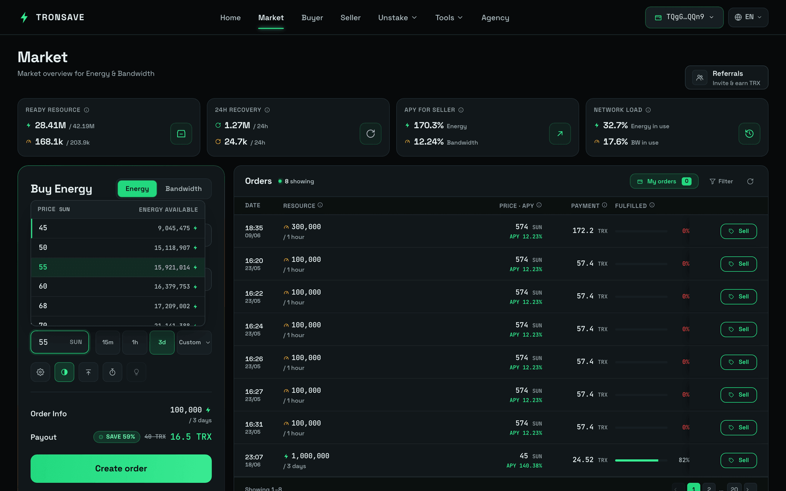
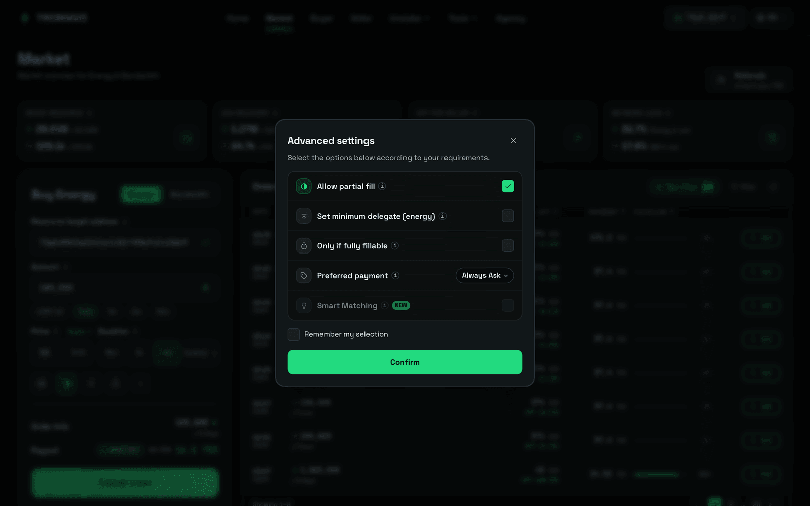
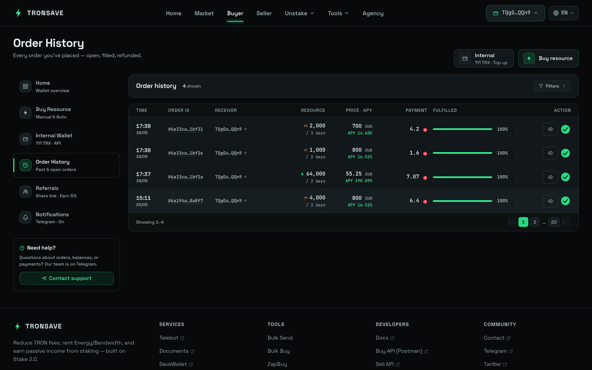

# Normal Order

A Normal Order is the standard purchase on TronSave: you specify the amount, price and duration, and the order matches against current market supply right away. See [Order Types](../../../concepts/order-types.md) for how it compares to Pending, Smart, and other flows.

## Create an order

1. Open [tronsave.io/market](https://tronsave.io/market).
2. Connect your wallet (e.g. TronLink).
3. Enter the **Amount** of Energy/Bandwidth to buy, the **Price**, and the **Duration**. You can optionally set a custom resource target address. Fill in the form, then click **Create order**.

<figure><figcaption></figcaption></figure>


Click the **Price** field to open the **Order Book** pop-up. From there you can check the available resources at different price levels and choose the most suitable price and quantity for your rental.


<figure><figcaption></figcaption></figure>

## Advanced settings

Open the **Settings** (⚙️) button to configure:

<table>
<thead>
<tr><th width="240">Setting</th><th>Description</th></tr>
</thead>
<tbody>
<tr>
<td><code>Minimum delegate</code> (Energy/Bandwidth)</td>
<td>The minimum amount of Energy/Bandwidth from a single provider that can be delegated to you. When set, the system matches your order only with providers whose available Energy/Bandwidth is equal to or greater than this value.</td>
</tr>
<tr>
<td><code>Allow partial fill</code></td>
<td>If checked, the order may be filled partially. If unchecked, the order will not be filled unless a single address can complete it in one transaction.</td>
</tr>
<tr>
<td><code>Immediate buy</code></td>
<td>If checked, the order must fill immediately. If the system is not ready to match it, the order is not created.</td>
</tr>
<tr>
<td><code>Priority payment</code></td>
<td>Preferred payment method. Default: always ask to confirm.</td>
</tr>
</tbody>
</table>

<figure><figcaption></figcaption></figure>

Once placed, the order appears on the **Orders** tab. If sufficient pool resource is available, it is filled automatically.

<figure><figcaption></figcaption></figure>

## Update the target address

You can change an order's target (receiving) address if the order is **not fully matched** and **one hour has passed** since creation.

1. Open the **My Orders** tab and click into **Order Detail**.

<figure><figcaption></figcaption></figure>

2. Click **Edit** and input the new address.

<figure><figcaption></figcaption></figure>

3. Click **Confirm**.

<figure><figcaption></figcaption></figure>

## Update the price

1. Click the **Edit** button.

<figure><figcaption></figcaption></figure>

2. Input the new price and click **Confirm**.

<figure><figcaption></figcaption></figure>

## Cancel an order

You can cancel an order if it is **not matched within 5 minutes** of creation. The cancellation fee is **5 TRX**.

1. Click the **Cancel** button on your order.

<figure><figcaption></figcaption></figure>

2. Click **Yes, I'm sure** to confirm the cancellation.

<figure><figcaption></figcaption></figure>

## Next steps

* [Order Types](../../../concepts/order-types.md) — Normal vs Pending, Smart, ZapBuy, and more
* [Pricing & APY](../../../concepts/pricing-and-apy.md)
* [Energy & Bandwidth](../../../concepts/energy-and-bandwidth.md)
