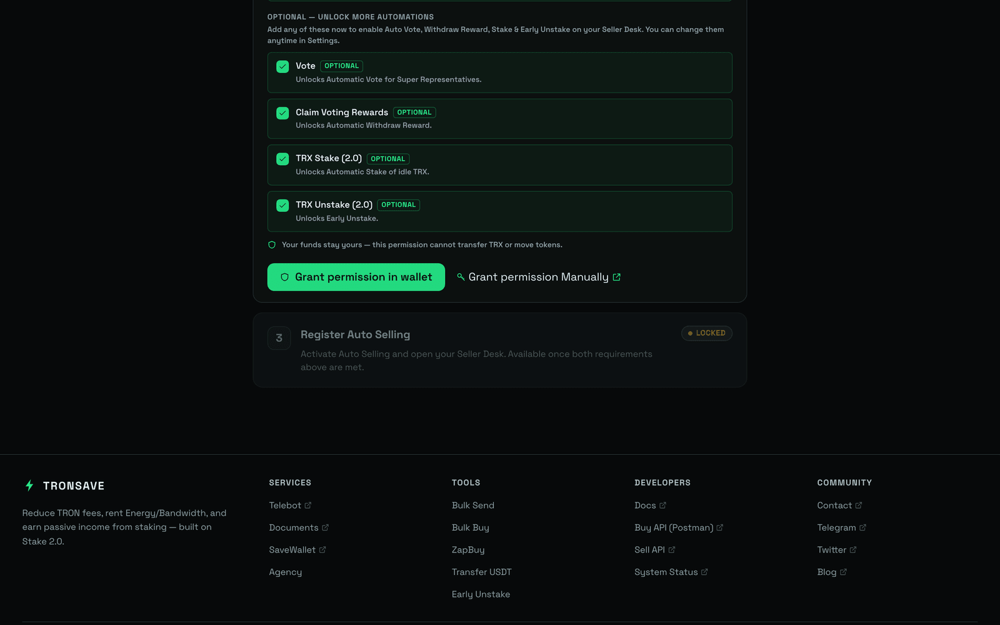

# Auto Sell

**Auto Sell** lets TronSave match and fill incoming buyer orders with your staked Energy or Bandwidth automatically. You set your price floor, duration limits, and profit share once, grant the system delegation permission, and TronSave handles matching, delegating, and paying out for you.


To sell, you first need staked resources to delegate. If you only hold TRX, stake it first — see [Get Energy by Staking 2.0](staking-2.0.md). For the underlying mechanics, see the [Staking 2.0](../../concepts/staking-2.0.md) and [Order Types](../../concepts/order-types.md) concepts.


## Configure Auto Sell

### Step 1: Open the Seller tab in the TronSave market

Go to the [Seller settings page](https://tronsave.io/dashboard/seller/settings).

### Step 2: Connect your TRON wallet and log in

* Open the [TronSave market](https://tronsave.io/dashboard/seller/settings) and connect your wallet.
* Click **Login TRONSAVE** and sign the message to log in.

<figure><figcaption></figcaption></figure>

### Step 3: Stake Energy/Bandwidth (optional)

_If you already have available resources, you can skip this step._

If you only hold TRX and haven't staked Energy or Bandwidth yet, stake before selling. You can do this in either of the following ways:

1. **Stake via TronScan** ([stake link](https://tronscan.org/#/wallet/resources)).
2. **Stake directly on TronSave** — click **Stake more**.

Choose **Energy** or **Bandwidth**, enter the **Staking Amount**, then click **Stake**.

<figure><figcaption></figcaption></figure>

### Step 4: Grant delegation permission to TronSave

Auto Sell needs permission to delegate resources from your account on your behalf.

### Step 5: Edit your Auto Sell conditions

Set the matching rules to fit your strategy.

<figure><figcaption></figcaption></figure>

| # | Setting                 | Description                                                                                                                                                               |
| - | ----------------------- | ------------------------------------------------------------------------------------------------------------------------------------------------------------------------- |
| 1 | `Automatic matching`    | Automatically match with orders that meet your criteria.                                                                                                                  |
| 2 | `Earning Share`         | The % profit you want to take. A higher share lowers your order's matching priority.                                                                                      |
| 3 | `Allow "Extend Order"`  | Allow the buyer to create an extended order.                                                                                                                              |
| 4 | `Max Delegate Duration` | The maximum delegation duration. Default is 30 days.                                                                                                                      |
| 5 | `Maintain undelegate`   | The amount of Energy to keep undelegated in the account. This amount is not used for orders.                                                                              |
| 6 | `Min price`             | The minimum Energy price per day, in SUN/day, for orders you are willing to freeze for.                                                                                   |
| 7 | `Min delegate amount`   | The minimum resource amount that can be used to fill an order. This helps maximize the total resources used from your address.                                            |
| 8 | `Automatic Reclaim`     | **TronSave:** only reclaim resources delegated to others through the TronSave system. **All:** reclaim all resources delegated to others once the delegation is unlocked. |

<figure><figcaption></figcaption></figure>

| #  | Setting                     | Description                                                                                                                              |
| -- | --------------------------- | ---------------------------------------------------------------------------------------------------------------------------------------- |
| 9  | `Automatic Vote`            | Automatically vote for Super Representatives to earn voting rewards.                                                                     |
| 10 | `Automatic Withdraw Reward` | Automatically claim and withdraw your voting rewards.                                                                                    |
| 11 | `Automatic Stake`           | Automatically stake when your balance reaches the threshold you set. The system runs a Staking 2.0 transaction to obtain Energy for you. |

<figure><figcaption></figcaption></figure>

| #  | Setting             | Description                                                                                                               |
| -- | ------------------- | ------------------------------------------------------------------------------------------------------------------------- |
| 12 | `Payment Address`   | The address that receives profit from Auto Sell.                                                                          |
| 13 | `Payment frequency` | How often payouts are made. **Immediate** after each filled order (fee 0.3 TRX per transaction), or **Daily** (zero fee). |

## Next steps

* Learn the mechanics: [Staking 2.0](../../concepts/staking-2.0.md) · [Order Types](../../concepts/order-types.md) · [Pricing & APY](../../concepts/pricing-and-apy.md)
* Get resources to sell: [Get Energy by Staking 2.0](staking-2.0.md)
