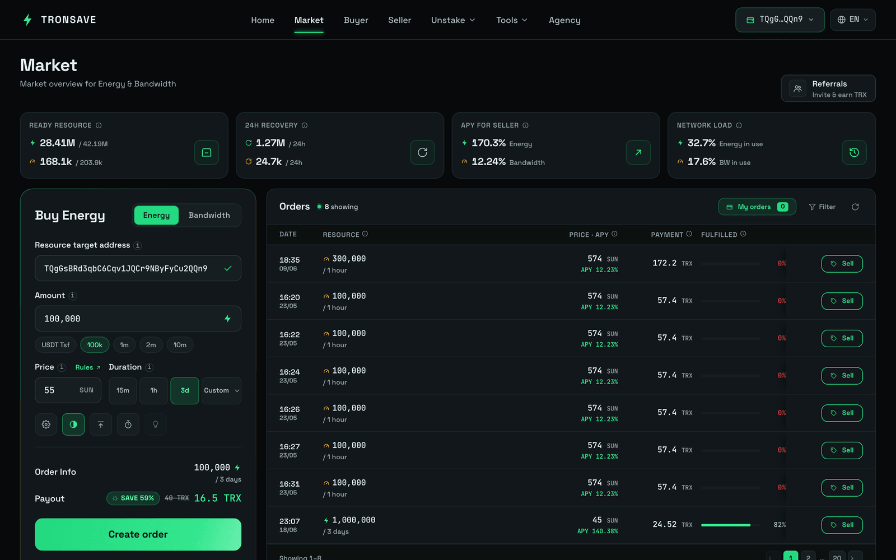

# Manual Sell

Manual Sell lets you pick an open buy order on the marketplace and fill it yourself with your staked resources. You can only fill a buy order manually while it has **not** already been matched automatically.


Manual Sell is for resources you have already staked. If you only hold TRX, stake first — see [Get Energy by Staking 2.0](staking-2.0.md).


## Before you start

These steps apply to every Manual Sell method.

### Step 1 — Stake Energy/Bandwidth (optional)

_Skip this step if you already have available resources._

If you only hold TRX and have not staked Energy or Bandwidth yet, stake before selling. You can do this in either of the following ways:

* **Stake directly on TronSave** — see [Get Energy by Staking 2.0](staking-2.0.md).
* **Stake via TronScan** — at [tronscan.org/#/wallet/resources](https://tronscan.org/#/wallet/resources).

### Step 2 — Connect your TRON wallet

Open the [TronSave market](https://tronsave.io/market) and connect your wallet. For step-by-step instructions, see [Connect Wallet](../connect-wallet.md).

### Step 3 — Find a buy order and click **Sell**

Browse the open buy orders and click **Sell** on the order you want to fill.

<figure><figcaption>
Click the "Sell" button
</figcaption></figure>

## Option 1 — Manual Sell (normal)

### Enter the delegate amount

Enter the amount of the resource you want to delegate to fill the order.

<figure><figcaption></figcaption></figure>

### Optional — Setting payment

You can change the address that receives the interest for this manual Energy sale order. Select **Setting payment** and enter the receiving address.

<figure><figcaption></figcaption></figure>

### Click **Fill** to execute the sell order

<figure><figcaption></figcaption></figure>

## Option 2 — Manual Sell (MultiSign)

The **MultiSign** feature lets you fill a buy order using Energy that another account has delegated authority over to you, rather than your own staked resources.

### Click **MultiSign Delegating**

<figure><figcaption></figcaption></figure>

In the Fill order table, complete the following fields:

<table>
<thead>
<tr><th>Field</th><th>Description</th></tr>
</thead>
<tbody>
<tr><td><code>MultiSign Account</code></td><td>The address that has delegated authority to you.</td></tr>
<tr><td><code>To delegate amount</code></td><td>The amount of Energy you want to sell.</td></tr>
</tbody>
</table>

You can also set the receiving address under **Setting payment**.

<figure><figcaption></figcaption></figure>

### Click **Fill** to execute the sell order

<figure><figcaption></figcaption></figure>

## Next steps

* [Get Energy by Staking 2.0](staking-2.0.md) · [Staking 2.0](../../concepts/staking-2.0.md)
* [Energy & Bandwidth](../../concepts/energy-and-bandwidth.md) · [Pricing & APY](../../concepts/pricing-and-apy.md)
