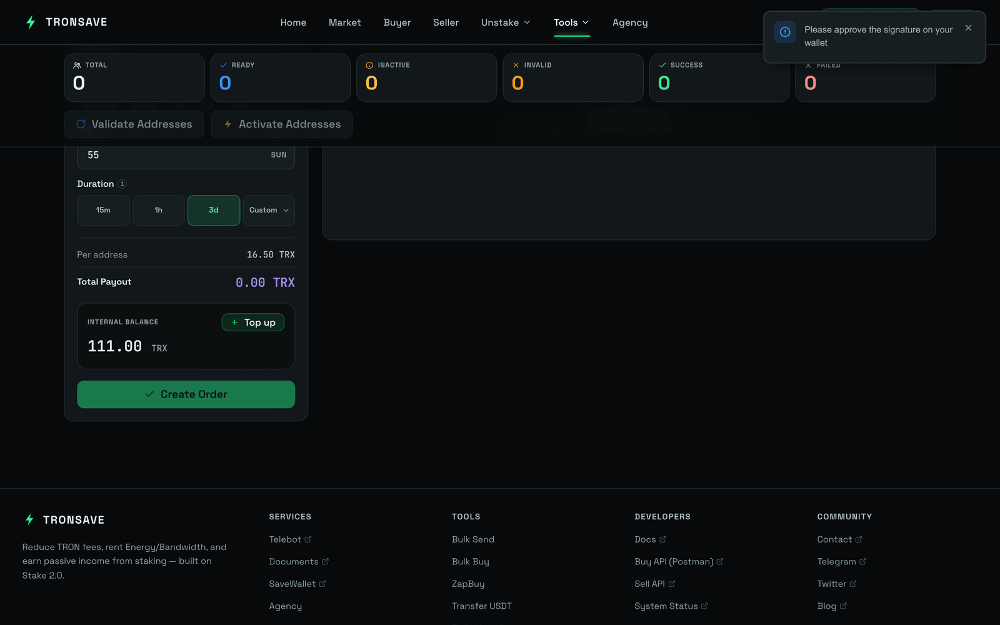

# Bulk Buy Resource

Bulk Buy Resource purchases resources for multiple accounts at once. Instead of repeating the buy flow per wallet, you upload a list of addresses, set one amount and duration, and TronSave delegates Energy directly to every address.

It's built for anyone managing many wallets — bots, user accounts, or distribution setups — where buying one address at a time isn't practical.

## When to use it

* Buy Energy for **multiple addresses** in one pass instead of repeating the flow manually per wallet.
* Manage many accounts, bots, or user wallets from a single screen.
* Energy is sent directly to each address — no per-wallet signing loop.


This tool complements the standard order flows. For everyday single-address buying, see [Buy Energy & Bandwidth](../buy/README.md).


## How to buy Energy for multiple addresses

### Step 1 — Open the tool

Go to [tronsave.io](https://tronsave.io/), open the **Tools** menu, and click [**Bulk Buy Resource**](https://tronsave.io/tools/multi-buy).

### Step 2 — Connect your wallet and fund your internal account

Make sure your TronSave internal account has enough balance to cover the bulk order. See [Get an API Key](../../developers/quickstart.md) for setup and deposit instructions.

### Step 3 — Import a CSV file

Upload a CSV file containing wallet addresses, one address per line.

<figure><figcaption></figcaption></figure>

### Step 4 — Set amount and duration

* Choose the **Amount** `[1]` and **Duration** `[2]`.
* Then **get the API Key** `[3]`.

<figure><figcaption></figcaption></figure>

### Step 5 — Check and activate

Review the status of all addresses. If any wallet is not activated, you can activate it directly from this screen.

<figure><figcaption></figcaption></figure>

<figure><figcaption></figcaption></figure>

### Step 6 — Buy Energy

* Once every address shows the **Ready** status, click **Confirm** to proceed with the Energy purchase.

<figure><figcaption></figcaption></figure>

* A **Success** status means the order was created successfully. You can verify the transaction details on Tronscan for confirmation.

<figure><figcaption></figcaption></figure>

## Next steps

* [Bulk Send Token](bulk-send-token.md) — distribute TRX and TRC20 tokens to many recipients via CSV.
* [Transfer USDT](transfer-usdt.md) — cost-optimized USDT transfers.
* [Buy Energy & Bandwidth](../buy/README.md) · [Energy & Bandwidth](../../concepts/energy-and-bandwidth.md)
