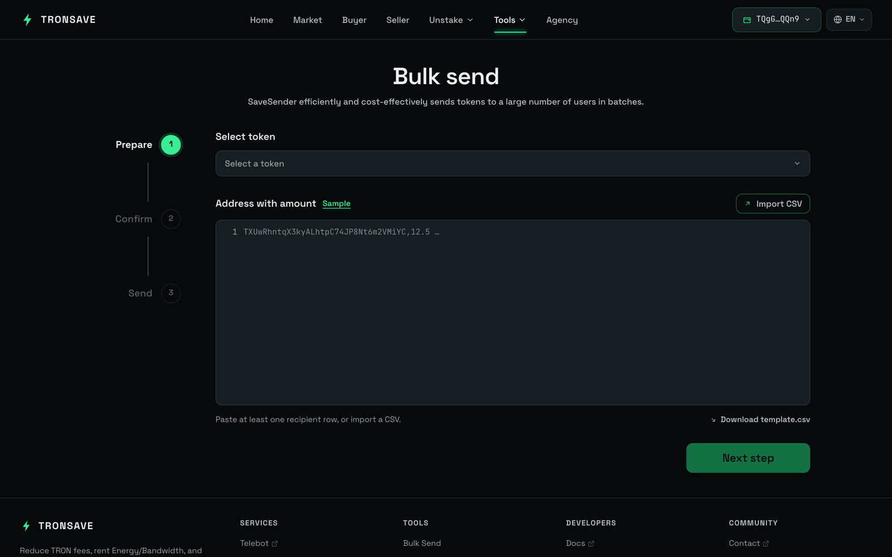
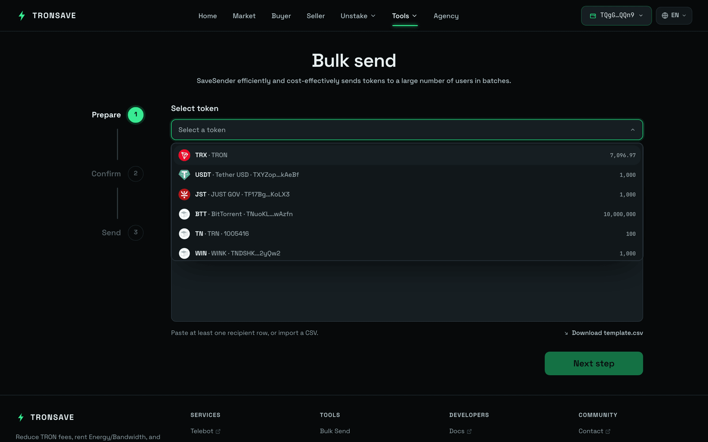

# Bulk Send Token

**SaveSender** sends tokens to a large number of recipients efficiently and cost-effectively. It is built for the TRON network and integrates Energy and Bandwidth so you pay far less in TRX fees than a plain on-chain transfer.

## What you get

* **Completely free to use** — no platform fees for sending tokens.
* **Built for TRON** — optimized for TRX and TRC20 tokens.
* **60–80% fee savings** — through integrated Energy and Bandwidth.
* **CSV upload** — prepare a list of recipients and amounts.
* **Fast** — send to hundreds of addresses in a few minutes.

## How to send TRC20 tokens in bulk

The flow below covers a TRC20 airdrop (it works for multisend too).

### Step 1: Open the tool

Go to [tronsave.io](https://tronsave.io/), open the **Tools** menu, and click [**Bulk Send Token**](https://tronsave.io/tools/bulk-send).

<figure><figcaption></figcaption></figure>

### Step 2: Prepare your CSV

Create a CSV listing each recipient's wallet address and token amount, for example `TAbc123xyz, 100.5`. Double-check the addresses.


* Each line must have an **address** and an **amount** separated by a comma, e.g. `TAbc123xyz, 100.5`.
* Duplicate addresses are not allowed.


### Step 3: Connect your wallet

Connect your wallet and make sure it holds enough TRX for fees and enough of the token you intend to send.

### Step 4: Select token and upload data

1. Choose the token.
2. Upload your CSV.
3. Verify the preview.

<figure><figcaption></figcaption></figure>

### Step 5: Approve the token (TRC20)

For TRC20 tokens you must approve the token before transferring it. The system automatically estimates the Energy required for the approval transaction.

Buy Energy first, then run the **Approve** step.

<figure><figcaption></figcaption></figure>

<figure><figcaption></figcaption></figure>

### Step 6: Send the token

Once the token is approved, the system moves to the **Send** step automatically.

TronSave estimates the Energy your transaction requires. To save fees, click **Buy Energy**.

* Wait 15–30 seconds for the Energy to be delegated to your wallet.
* Then confirm to proceed with the bulk send.


Buying Energy here reduces TRX gas costs and keeps delivery smooth.


<figure><figcaption></figcaption></figure>

<figure><figcaption></figcaption></figure>

### Step 7: Verify on TRONSCAN

Check [TRONSCAN](https://tronscan.org/) to confirm the transfers succeeded.

<figure><figcaption></figcaption></figure>

<figure><figcaption></figcaption></figure>

## Next steps

* [Buy Energy & Bandwidth](../buy/README.md) — the resources that power your bulk send.
* [Energy and Bandwidth](../../concepts/energy-and-bandwidth.md) — why these resources lower transfer fees.
