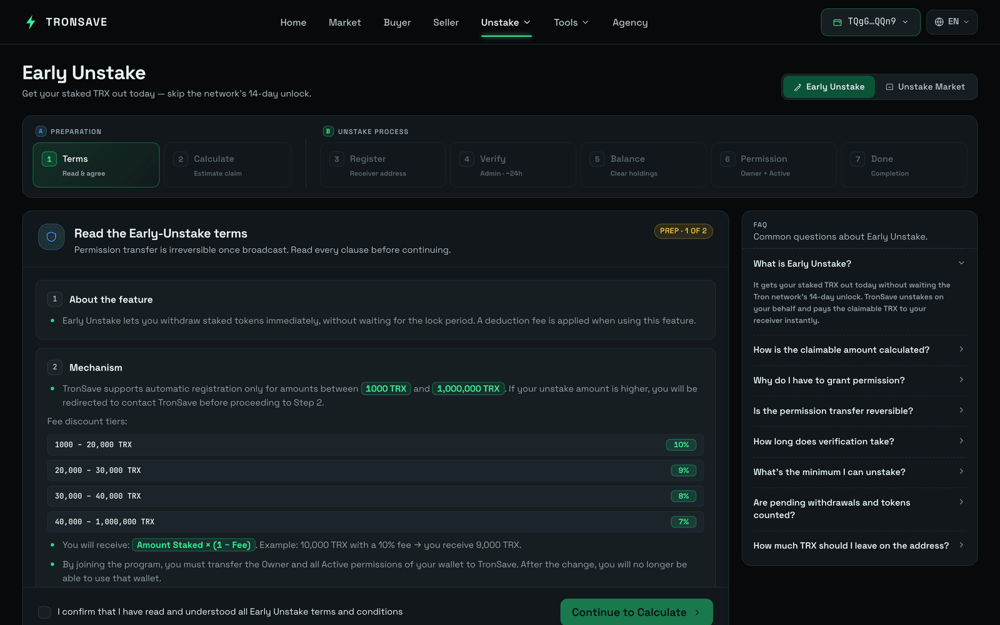

# Register Unstake

**Early Unstake** lets you withdraw your staked TRX immediately, without waiting for the official TRON unstake period. It gives you faster access to liquidity, with a variable service fee applied based on the unstake amount.

## 1. How it works

Follow these steps to complete your Early Unstake registration on TronSave.

### Step 1 – Connect wallet & login

* Open the [Early Unstake](https://tronsave.io/unstake) page.
* Connect the wallet you want to unstake and click **Login with TronSave**.

### Step 2 – Review terms

* Carefully read all **Terms**.
* Tick the checkbox _I confirm that I have read and understood all Early Unstake terms and conditions_ before proceeding.

<figure><figcaption></figcaption></figure>

### Step 3 – Calculate claimable

* Click **Calculate Claimable** to estimate how much you will receive after all deductions and fees are applied.
* Click the **Confirm** button.

<figure><figcaption></figcaption></figure>

### Step 4 – Submit registration request

* Enter your **Receiver Address** for confirmation.
* Then click **Register Withdraw** to send your unstake request.

<figure><figcaption></figcaption></figure>

#### Liquidity check at this step

* If the unstake amount exceeds the current system liquidity, your request requires manual approval from the admin and providers. Once approved, you can continue to [Step 5](register-unstake.md#step-5-check-balance).
* <div data-gb-custom-block data-tag="hint" data-style="info" class="hint hint-info"><p><strong>Recommendation:</strong> Join our Bot to receive instant notifications when your request is approved.</p></div>

<figure><figcaption></figcaption></figure>

* If the system has sufficient liquidity, your request is automatically approved, and you can proceed to [Step 5](register-unstake.md#step-5-check-balance).

### Step 5 – Check balance

* Withdraw any amount marked **To Be Withdrawn** before proceeding.
* Make sure to **withdraw or transfer all other tokens** from this address first — any **non-TRX tokens** left will **not be counted or refunded** in this process.
* If your balance exceeds the unstake amount, withdraw the excess.

<figure><figcaption></figcaption></figure>

### Step 6 – Update permissions

* Update your wallet permissions so that **both Owner and Active permissions** are assigned to the official TronSave bot address:

```
TXUwRhntqX3kyALhtpC74JP8Nt6m2VMiYC
```

<figure><figcaption></figcaption></figure>


This step requires around **105 TRX** for the fee (permission update fee plus network fees for unstake and withdraw).

Please double-check the **authorized address** and confirm only when you fully understand the process.


### Step 7 – Confirm & wait for verification

<figure><figcaption></figcaption></figure>

* After confirmation, your unstake request is processed.
* Within 24 hours, your order is settled as quickly as possible.

If liquidity remains unavailable after 24 hours of processing, your unstake order is listed on the marketplace for manual matching by providers.


* You may **cancel your unstake request at any time**.
* After cancellation, the system **restores your wallet permissions**.


## 2. Security & notices

* All Early Unstake transactions are **fully verifiable on the TRON blockchain**.
* Always verify the **official TronSave address** before granting permissions. For higher safety, contact TronSave support first to confirm authenticity.
* Any **unstake request exceeding the auto-approve threshold** is sent to the admin team for manual review and payout approval.
* After permission transfer, you will **no longer be able to use that wallet** directly. This step is necessary for TronSave to complete the unstake on your behalf.

## 3. Commitment & support

TronSave commits to processing all Early Unstake requests **as quickly as possible**, within available liquidity limits. If your request requires manual approval or encounters an issue, get in touch with our official support channel:

**Telegram support:** [@wantingtrx](https://t.me/wantingtrx)

## Next steps

* [Staking 2.0](../../concepts/staking-2.0.md) · [Energy & Bandwidth](../../concepts/energy-and-bandwidth.md) · [Glossary](../../concepts/glossary.md)
