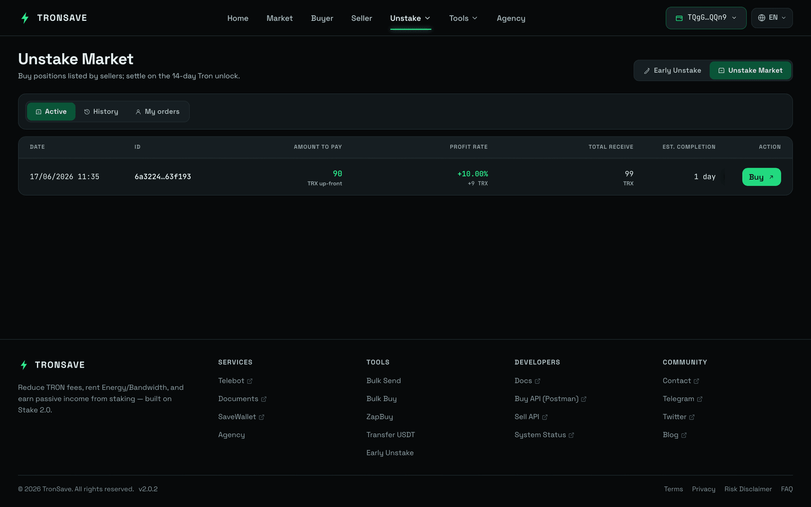
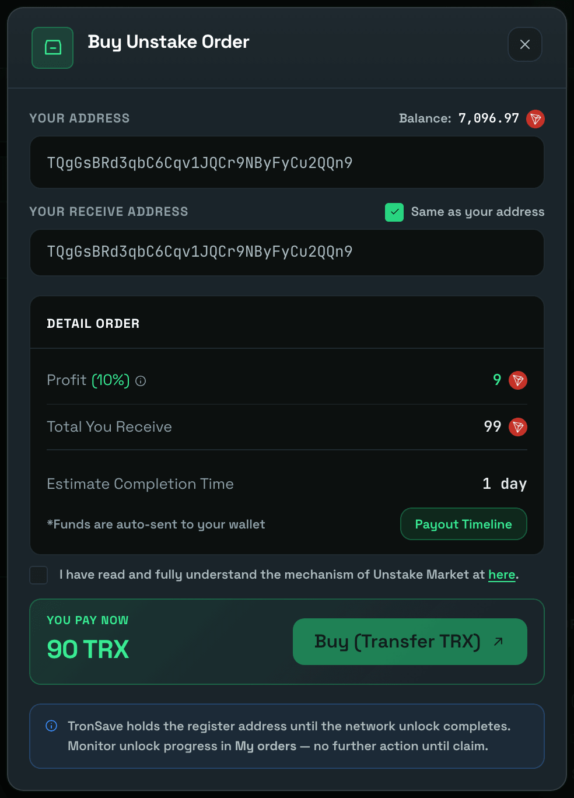
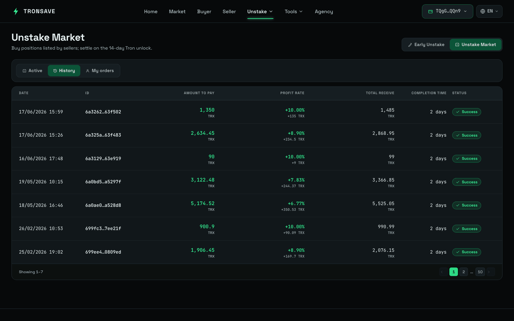

# Unstake Market

The **TronSave Unstake Market** is an intermediary marketplace that connects users who want to unstake their TRX early with users who have available TRX to fund those exits. It enables an **Early Unstake** before the standard [14-day unstaking period](../../concepts/staking-2.0.md#unstaking-period), while letting participants who fund orders earn **up to 10% per order**.

## How it works

### Step 1 — Connect wallet and log in

* Open the [Unstake Market](https://tronsave.io/unstake/market) page.
* Connect the wallet you want to use and click **Login with TronSave**.

### Step 2 — Select an order

<figure><figcaption></figcaption></figure>

* Browse the available orders in the **List of Orders** section.
* Choose an order that fits your preference.
* Click the **Buy** button on the selected order.

### Step 3 — Fill in purchase details

<figure><figcaption></figcaption></figure>

* Enter the **Receiving Address** where the payout will be sent. You can either:
  * Enter a custom address, or
  * Select **Same as your address** to use the currently connected wallet address.
* Tick the confirmation checkbox: _I have read and fully understand the mechanism of Unstake Market._

### Step 4 — Confirm and pay

* Click **Buy (Transfer TRX)**.
* Sign the transaction in your wallet to complete the purchase.

### Step 5 — Track your orders and payout

After purchasing, you can monitor your orders in two tabs:

* **My Active** — orders that are currently in progress and awaiting payout.
* **My Completed** — orders that have been fully paid and completed.

Funds are sent to your receiving address according to the schedule shown in the **Payout Time**.

<figure><figcaption></figcaption></figure>

## Telegram notifications

By registering your Telegram account, you receive **real-time notifications** about your unstake orders — in particular, **payout updates**.

After successful verification, the system confirms your subscription. From that point on, you receive an **UNSTAKE PAYOUT** notification whenever a payout is sent to your address, so you can track payment progress and never miss an incoming payout.

To add your Telegram contact:

* Enter your Telegram ID in the provided field and click **Confirm**.

<figure><figcaption></figcaption></figure>

<figure><figcaption></figcaption></figure>

* After entering your Telegram ID, click **GET CODE** to start the verification.

<figure><figcaption></figcaption></figure>

* A link to the TronSave Telegram bot appears — click it to be redirected to Telegram.

<figure><figcaption></figcaption></figure>

* Click **Click here to verify** to be automatically redirected to the verification page, or copy the code and enter it manually.

<figure><figcaption></figcaption></figure>

* Once verified, you start receiving payout notifications. You will then receive an **UNSTAKE PAYOUT** notification whenever a payout is sent.

<figure><figcaption></figcaption></figure>

## Next steps

* Learn how the 14-day unstaking period works in [Staking 2.0](../../concepts/staking-2.0.md).
* See the [Early Unstake overview](README.md) for the full flow.
